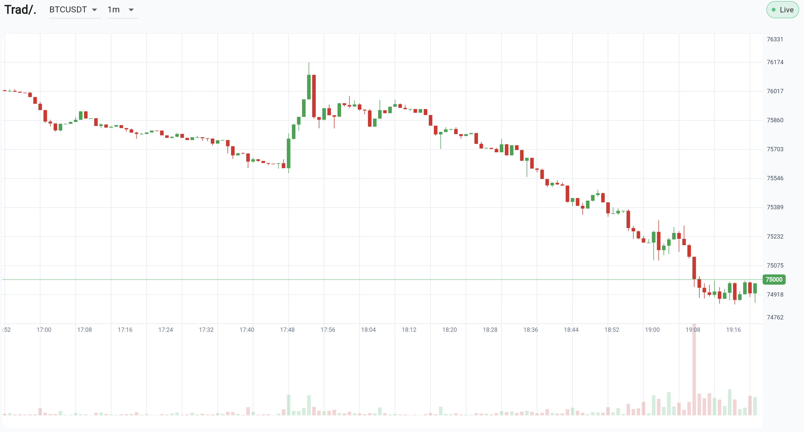
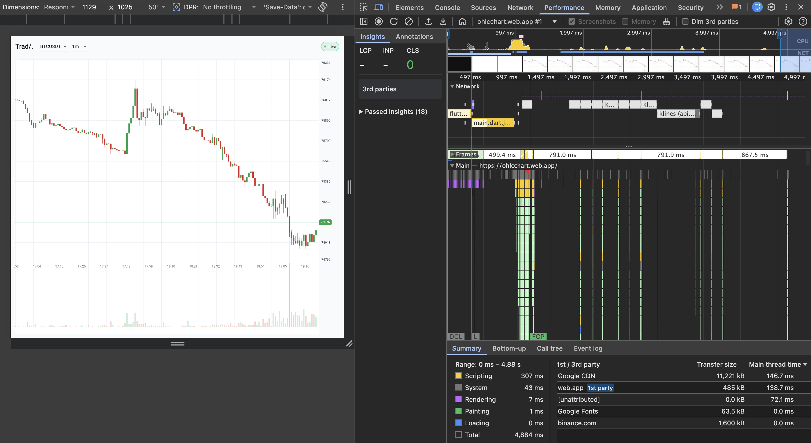
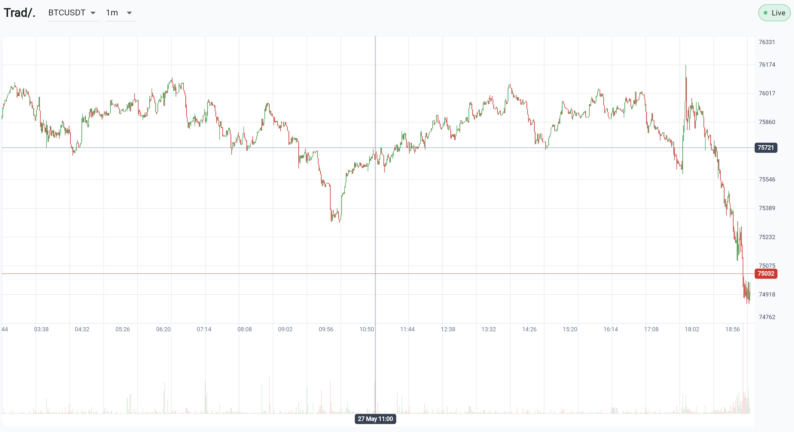

<div align="center">

# 🚀 High-Performance Flutter OHLC Chart

### Interactive candlestick chart built for Flutter Web with real-time updates, smooth zooming, panning, and large dataset rendering.

<br>

[](https://ohlcchart.web.app/)

### 👇 Try the application here 👇

# [👉 CLICK HERE FOR DEMO 👈](https://ohlcchart.web.app/)

<br>

</div>


## Requirements Coverage

| Requirement | Status | Comment |
|---|---|---|
| Real-time WebSocket Updates | ✅ | Integrated Binance WebSocket API for live price updates. |
| Historical Data Pagination | ✅ |REST API integration with background pagination backfill (supports up to 10000 candles).
| Pan / Drag Interaction | ✅ | Full support for pan (drag).
| Zoom Support | ✅ | Full support for zoom (pinch/scroll).
| Crosshair Interaction | ✅ | Displays precise time and price on hover/touch.
| Symbol & Interval Switching | ✅ | Ability to switch between different trading pairs (symbols) and time intervals.
| Flutter Web Optimization | ✅ |Specifically tuned for Flutter Web performance.
| Large Dataset Rendering | ✅ | Supports up to 10000 candles


## Screenshots / GIF
<p align="center">
  
</p>
<p align="center">
  
</p>
<p align="center">
  
</p>

## Technical Architecture
Here is my architecture.
- **Framework:** Flutter Web.
- **Data Layer:** `CandleRepository` manages state, intelligently merging REST history with live WebSocket updates.
- **Network:** `http` for REST pagination, `web_socket_channel` for Binance live streams.
- **State Management:** `ValueNotifier` and `ListenableBuilder` for targeted, granular UI rebuilds without relying on heavy external state management libraries.

## Rendering Approach
Here are my engineering decisions for rendering.
- **CustomPaint & RepaintBoundary:** The chart is built entirely from scratch using `CustomPaint` rather than wrapping a heavy charting library.
- **Layer Separation:** Rendering is split into two distinct layers:
  1. `OhlcvPainter`: Draws the static/historical elements (candles, volume, grid, axes).
  2. `OhlcvCrosshairPainter`: Draws the highly dynamic crosshair and labels.
- **Why?** This isolates high-frequency interaction updates from the heavier candle rendering pipeline, significantly reducing unnecessary repaints during continuous pointer movement.
- **Throttling:** Crosshair updates are coalesced and throttled using `SchedulerBinding.instance.scheduleFrameCallback` to align perfectly with the browser's animation frames.

## Performance Considerations
Here is the performance strategy.
- **Viewport Culling:** Only candles visible within the current zoom/pan viewport are painted.
- **Background Backfilling:** Historical data fetches a small batch initially for an instant load, then silently backfills up to 10000 candles in the background.
- **In-Place Updates:** Live WebSocket candles mutate the existing list in-place rather than allocating new lists every tick, reducing Garbage Collection (GC) pauses.
- **Memory Management:** Object creation inside the `paint` loop is strictly minimized (e.g., reusing `Paint` objects).

## Benchmark Results

Benchmark recorded using a 60-second continuous stress test simulating aggressive real-world interaction patterns:

- Continuous horizontal dragging/panning
- Rapid zoom in / zoom out operations
- Sustained crosshair movement
- Frequent viewport recalculations
- Dense candle rendering under high pointer event frequency

| Metric | Value |
|---|---|
| Trace Duration | 69.41s |
| Observed Frame Rate | 43.15 fps |
| Average Frame Work | 3.24ms |
| P95 Frame Work | 10.49ms |
| Paint Cost | 0.02ms |
| Over-Budget Frames | 1.8% |
| Peak Heap Usage | 56.74MB |


The benchmark demonstrates that the rendering pipeline remains stable even under sustained heavy interaction workloads.

Key observations:

- P95 frame work remains comfortably below the 16.67ms frame budget required for 60fps rendering.
- Paint cost is extremely low, indicating the `CustomPainter` implementation is not the bottleneck.
- Only 1.8% of frames exceeded the frame budget during aggressive interaction.
- Remaining frame pressure primarily originates from browser JavaScript event loop overhead during continuous pointer movement on Flutter Web.

## Engineering Tradeoffs

- Chose `ValueNotifier` over heavier state management solutions to minimize rebuild overhead and keep interaction latency low.
- Prioritized viewport-based rendering instead of full dataset painting to support large candle counts efficiently.
- Focused optimization efforts on repaint minimization and interaction smoothness rather than feature completeness.
- Current implementation prioritizes rendering performance over advanced TradingView-style tooling/features.

## Setup Instructions

Here is how to run the project locally.

### Requirements

- Flutter 3.29.0
- Chrome Browser

### Clone Repository


```bash
# Clone repo
git clone git@github.com:craggi/ohlcv_chart.git

cd ohlcv_chart
```

#### Install Dependencies

```bash
flutter pub get
```

#### Run Locally

```bash
flutter run -d chrome
```

#### Build for Production

```bash
# WASM build recommended for best Flutter Web performance
flutter build web --wasm
```

## Project Structure
```text
lib/
├── chart/          # Chart rendering logic (OhlcvPainter, Crosshair, Viewport)
├── constants/      # App-wide constants and styling
├── data/           # Binance REST/WebSocket clients and Repository
├── models/         # Data models (Candle)
└── main.dart       # App entry point and UI layout
```